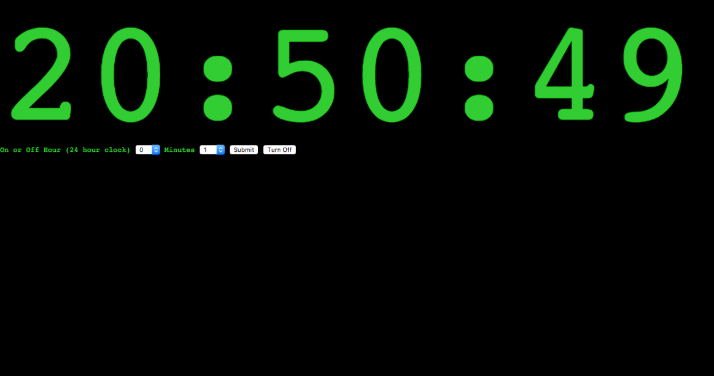
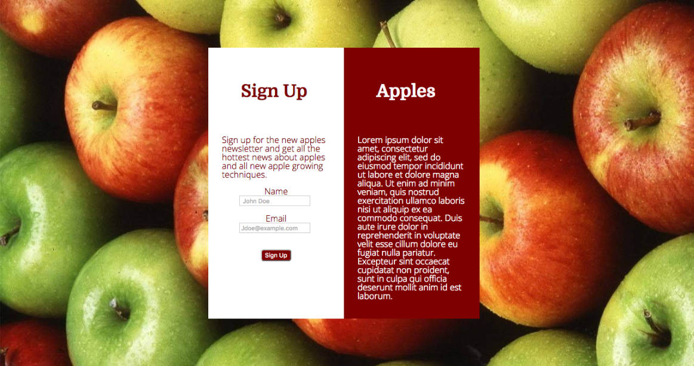
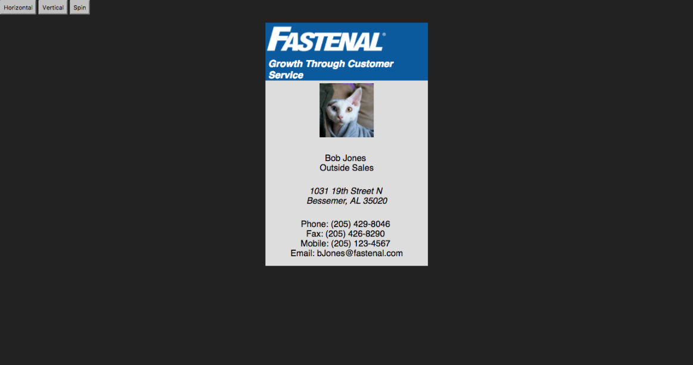
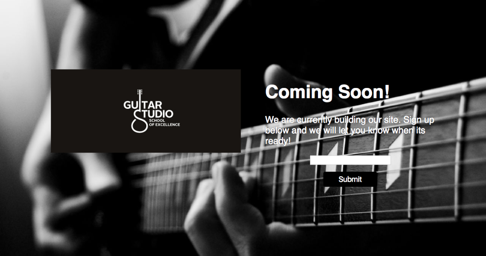
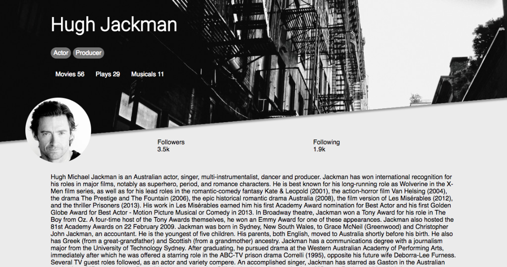
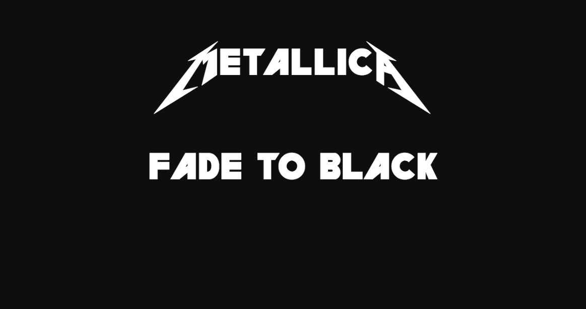
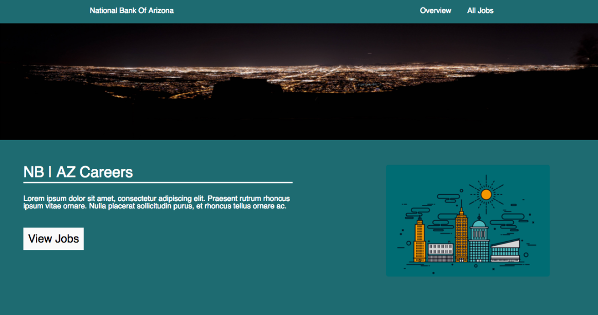

Note: Some of these are made using older tools. I will not update because there wouldn't be a gain. 

## [Alarm Clock](alarmClock/index.html)
Code:

+ [html, view source](alarmClock/index.html)
+ [sass](alarmClock/css/main.scss)
+ [javascript](alarmClock/js/script.js)

This a simple alarm clock I made. It's 24 hours and I would like to make it 12 hours instead. I only used HTML, CSS, and Javascript to make this, no frameworks.

## [Apples](apples/index.html)
Code: 

+ [html, view source](apples/index.html)
+ [sass](apples/css/main.scss)
+ No JS

I saw this layout somewhere and wanted to recreate it. It doesn't do anything. It's just a mock, once I learn more about server side stuff I'd like to make it a full functioning page where you can plug it in and just change the CSS.

## [Business Card](businessCard/index.html)
Code: 

+ [html, view source](businessCard/index.html)
+ [CSS](businessCard/styles.css)
+ [JS](businessCard/main.js)

When I made this I was working at Fastenal. The horizontal version of this is what our business cards looked like. I got bored one day and made this.

## [Coming Soon Page](coming-soon/index.html)
Code: 

+ [html, view source](coming-soon/index.html)
+ [CSS](coming-soon/css/main.css)
+ No JS

This is pretty much the same as the apples site. I think I saw this on a job application.

## [Diagonal Portfolio](diagonal-portfolio/src/index.html)
Code: 

+ [html, view source](diagonal-portfolio/src/index.html)
+ [CSS](diagonal-portfolio/src/css/main.scss)
+ No JS

I found this on reddit [here.](https://stories.uplabs.com/can-you-code-this-ui-concept-9e4ba76b437e#.anazk8doj)
 [More specifically](https://material.uplabs.com/posts/diagonallayout-library)
It's just a mock up. I took the content and movie posters from [IMDB](http://www.imdb.com/name/nm0413168/?ref_=nmbio_bio_nm)

## [Fade To Black](fadeToBlack/index.html)
Code: 

+ [html, view source](fadeToBlack/index.html)
+ [CSS](fadeToBlack/style.css)
+ No JS

This just fades the back ground from white to black revealing the text while playing Fade to Black by Metallica

## [Input Box](inputBox/index.html)
Code: 

+ [html, view source](inputBox/index.html)
+ [CSS](inputBox/css/main.scss)
+ [JS](inputBox/script.js)

A screenshot wouldn't show anything useful, click the title to check it out.
A simple input box that changes when you click to enter your text.

## [National Bank AZ](national-bank-az/index.html)
Code: 

+ [html, view source](national-bank-az/index.html)
+ [CSS](national-bank-az/css/main.scss)
+ No JS

Mock up of page I found on [Dribbble.](https://dribbble.com/shots/2388752-National-Bank-of-Arizona-Material-Design-Concept)

## [Title Change](title-change/index.html)
Code: 

+ [html, view source](title-change/index.html)
+ [CSS](title-change/main.css)
+ [JS](title-change/script.js)

The h1 changes once the user scrolls to a nex section.
Again a screenshot wouldn't show anything useful, click the title and check it out.